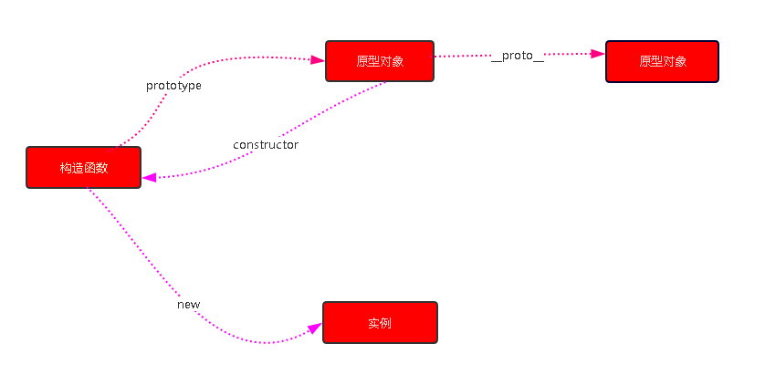
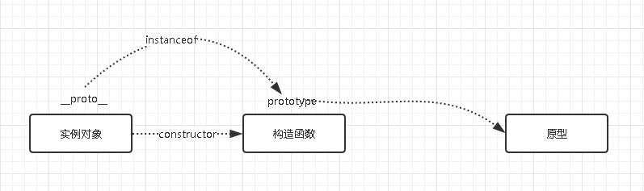
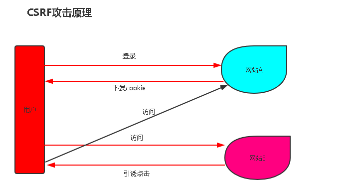

# :bookmark_tabs:前端工程师面试所具备的知识梳理

## :pencil:网页布局

#### :memo:相对定位布局实现自适应

```html
<!DOCTYPE html>
<html lang="en">
<head>
    <meta charset="UTF-8">
    <title>Title</title>
    <style>
        .layout .box1{
            width: 33.3%;
            height: 300px;
            background-color: rosybrown;
            float: left;
            position: relative;
        }
        .layout .box2{
            width: 33.3%;
            float: left;
            height: 300px;
            background-color: brown;
            position: relative;
        }
        .layout .box3{
            width: 33.3%;
            float: left;
            height: 300px;
            background-color: aquamarine;
            position: relative;
        }
    </style>
</head>
<body>

<section class="relative layout">
    <div class="box1"></div>
    <div class="box2">相对定位自适应</div>
    <div class="box3"></div>
</section>

</body>
</html>
```

#### :memo:绝对定位布局自适应

```html
<!DOCTYPE html>
<html lang="en">
<head>
    <meta charset="UTF-8">
    <title>Title</title>
    <style>
        *{
            margin: 0;
            padding: 0;
        }
        .layout {
            width: 100%;
        }
        .layout .box1{
            width: 33.3%;
            height: 300px;
            background-color: rosybrown;
            position: absolute;
            left: 0;
        }
        .layout .box2{
            width: 33.3%;
            height: 300px;
            background-color: brown;
            position: absolute;
            right: 0;
            left: 0;
            top: 0;
            bottom: 0;
            margin: 0 auto;
        }
        .layout .box3{
            width: 33.3%;
            height: 300px;
            background-color: aquamarine;
            position: absolute;
            right: 0;
        }
    </style>
</head>
<body>

<section class="relative layout">
    <div class="box1"></div>
    <div class="box2">相对定位自适应</div>
    <div class="box3"></div>
</section>

</body>
</html>
```
## :pencil:BFC

#### :memo:概念

块格式化上下文（Block Formatting Context，BFC） 是Web页面的可视化CSS渲染的一部分，是布局过程中生成块级盒子的区域，也是浮动元素与其他元素的交互限定区域。

#### :memo:下列方式会创建块格式化上下文：

- 根元素或包含根元素的元素
- 浮动元素（元素的 float 不是 none）
- 绝对定位元素（元素的 position 为 absolute 或 fixed）
- 行内块元素（元素的 display 为 inline-block）
- 表格单元格（元素的 display为 table-cell，HTML表格单元格默认为该值）
- 表格标题（元素的 display 为 table-caption，HTML表格标题默认为该值）
- 匿名表格单元格元素（元素的 display为 table、table-row、 table-row-group、table-header-group、table-footer-group（分别是HTML table、row、tbody、thead、tfoot的默认属性）或 inline-table）
- overflow 值不为 visible 的块元素
- display 值为 flow-root 的元素
- contain 值为 layout、content或 strict 的元素
- 弹性元素（display为 flex 或 inline-flex元素的直接子元素）
- 网格元素（display为 grid 或 inline-grid 元素的直接子元素）
- 多列容器（元素的 column-count 或 column-width 不为 auto，包括 column-count 为 1）
- column-span 为 all 的元素始终会创建一个新的BFC，即使该元素没有包裹在一个多列容器中（标准变更，Chrome bug）。
块格式化上下文包含创建它的元素内部的所有内容.

***BFC子元素即使是float也会参与父元素的高度计算***

## :pencil:DOM事件

#### :memo:DOM事件的级别

- DOM0   `element.onclick = function(){}`
- DOM2   `element.addEventListener('click',function(){},false)`
- DOM3   `element.addEventListener('keyup',function(){},false)` 新增诸多鼠标键盘事件
#### :memo:DOM事件模型

- 自上而下捕获，自下而上冒泡

#### :memo:DOM事件流

- 第一阶段  捕获
- 第二阶段  目标阶段  (到达目标元素)
- 第三阶段  冒泡阶段  (从目标元素冒泡到window对象)

#### :memo:描述DOM事件捕获的具体流程

- window `-->` document `-->` html  `-->` body `-->` 父级元素 `-->` 目标元素

#### :memo:EVENT对象的常见应用

- event.preventDefault() 阻止默认事件
- event.stopPropagation() 阻止冒泡事件
- event.stopImmediatePropagation()  在A中阻止B事件
- event.currentTarget  当前绑定事件的对象
- event.target  应用于事件委托

#### :memo:自定义事件

```javascript
var eve = new Event('custome');

ev.addEventListener('custome',function(){
console.log('custome');
})

ev.dispatchEvent(eve)
```

- DEMO

```html
<!DOCTYPE html>
<html lang="en">
<head>
    <meta charset="UTF-8">
    <title>Title</title>

    <script>
        const eve = new Event('warning');
        console.log(eve);

    </script>
</head>
<body>

<button class="test">测试自定义事件</button>

<script>
    document.querySelector('.test').addEventListener('warning',function () {
         alert('你好，我是自定义事件warning!');
    });
    document.querySelector('.test').dispatchEvent(eve);
</script>

</body>
</html>
```

## :pencil:HTTP协议

#### :memo:HTTP协议的主要特点

- 简单快速(URI固定)
- 灵活()
- 无连接(连接一次就会断掉不会保持连接)
- 无状态(客户端与服务端是两种身份)

#### :memo:HTTP报文的组成部分

- 请求报文
  - 请求行(HTTP方法，链接地址，http协议以及版本)
  - 请求头（Key and value）
  - 空行（告诉服务端解析请求体）
  - 请求体
- 响应报文
  - 状态行（HTTP版本，状态码）
  - 响应头
  - 空行
  - 响应体


#### :memo:HTTP方法

- get ----->获取资源
- post ----->传输资源
- put ---->更新资源
- delete ---->删除资源
- head ---->获得报文收首部

#### :memo:Post与Get的区别

- GET在浏览器回退是无害的，而POST会再次提交请求。
- GET产生的URL地址可以被收藏，而POST不可以。
- GET请求会被浏览器主动缓存，而POST不会，除非手动设置。
- GET请求只能进行URL编码，而POST支持多种编码格式。
- GET请求参数会被完整保留在浏览器历史记录中，而POST中的参数不会被保留。
- GET请求在URL中传送的参数是有长度限制的，而POST没有限制。
- 对参数的数据类型，GET只接受ASCII字符，而POST没有限制。
- GET比POST更不安全，因为GET参数会暴露在URL中，所以不能用来传递敏感信息。
- GET参数通过URL传递，POST放在Request body中。

#### :memo:HTTP状态码

- 1xx：指示信息-表示请求已经接收，继续处理
- 2xx：成功-表示请求已经被接收
- 3xx：重定向-要完成请求必须进步性更近异一步的操作
- 4xx：客户端错误-请求有语法错误或者请求无法实现
- 5xx：服务器错误-服务器未能实现合法的请求或者服务器内部代码有问题

------------------------------------------------------------------------------
>进一步举例

- 200  OK：客户端请求成功
- 206  Partial Content：客户发送了一个带有Range头的GET请求，服务器完成了它
- 301  Moved Permanently：所请求的页面已经转移至新的URL
- 302  Found：所请求的页面已经临时转移至新的url
- 304  Not Modified：客户端有缓冲的文档并发出了一个条件请求，服务器告诉客户端，原来缓冲的文档还可以继续使用

#### :memo:什么是持久连接

- HTTP协议采用“请求-应答”模式，当使用普通模式，即非Keep-Alive模式时，每个请求/应答客户和服务器都要创建一个连接，完成之后立即断开连接(HTTP协议为无连接的协议)
- 当使用Keep-Alive模式（又称持久连接，连接重用）时，Keep-Alive功能使得客户端到服务器端的连接持续有效，当出现对服务器的后继请求时，Keep-Alive功能避免了建立或者重新建立连接

#### :memo:什么是管线化

- 在使用持久连接的情况下，某个连接上的消息的传递类似于

```bash
请求1->响应1->请求2->响应2->请求3->响应3
```

- 管线化指的是在持久连接的基础上把所有的请求一次性打包过去，类似于

```bash
请求1->请求2->请求3->响应1->响应2->响应3
```

>特点

- 管线化机制通过持久连接完成，仅HTTP/1.1支持此技术
- 只有GET和HEAD请求可以进行管线化，而POST则有所限制
- 初次创建连接的时候不应启动管线机制，因为对方（服务器）不一定支持HTTP/1.1版本的协议
- 管线化不会影响响应的顺序，如上面的例子所示，响应返回的顺序并未改变
- HTTP/1.1要求服务器端支持管线化，但是并不要求服务器端也对响应进行管线化处理，只是要求对于管线化的请求不失败即可
- 由于上面提到的服务器端问题，开启管线化很可能并不会带来大幅度的性能提升，而且很多服务器端和代理程序对于管线化的支持并不好，因此现代浏览器如chrome和firefox默认并未开启管线化支持

## :pencil:原型链

#### :memo:创建对象有几种方法

```javascript
const obj = {name:'张三'};

const obj1 = new Object({name:'张三'});
```

```javascript
const obj = function (name){
this.name = name
}

const obj1 = new obj('张三');
```

```javascript
const obj = {name:'张三'}

const obj1 = Object.create(obj);

//
```
#### :memo:原型、构造函数、实例、原型链




#### :memo:instanceof的原理



- instanceOf的原理就是判断实例对象的`__proto__`属性和构造函数的`prototype`是不是同一个引用。


>Demo

```javascript
const obj = function (name){
this.name = name
}

const obj1 = new obj('张三');

console.log(obj1 instanceOf obj)
console.log(obj1 instanceOf Object)
```
#### :memo:new运算符

- 步骤一：一个新对象被创建，它继承自foo.prototype
- 步骤二：构造函数foo被执行，执行的时候，相应的参数会被传入，同时执行上下文(this)会被指定为这个新实例。new foo等同于new foo(),
只能用在不传递任何参数的情况下。
- 步骤三：如果构造函数返回了一个“对象”，那么这个对象又会取代整个new出来的结果。如果构造函数没有返回对象，那么new出来的结果为步骤一创建的对象。

## :pencil:面向对象

#### :memo:类与实例

- 类的声明

```javascript
/**
 * 传统类的声明
 */

 function Animal(name) {
  this.name = name;
 }

```

```javascript
 /**
  * ES6中类的声明
  */

  class Animal {

    constructor(name){
       this.name = name;
    }

    // other methods
  }
```

- 生成实例

```javascript

 /**
  * 实例化一个类
  */

  new Animal('鸽子');
```
#### :memo:类与继承

- 如何实现继承

  - 继承的本质就是原型链

- 继承的几种方式

  - 构造函数实现继承
  ```javascript
    function Parent(name){
      this.name = name;
    }

    function Child(){
      //父类挂载在子类
      Parent.call(this);
      // Parent.apply(this);
    }

    //缺点
    //Parent原型链上的内容并没有被Child继承
  ```
  - 原型链实现继承

  ```javascript
      function Parent(name){
         this.name = name;
       }

       function Child(){

       }

       Child.prototype = new Parent('鸽子');

       //缺点
       //不同的实例对象共享属性
  ```
  - 组合方式

  ```javascript
         function Parent(name){
           this.name = name;
         }

         function Child(){
          Parent.call(this);
         }

        Child.prototype = new Parent();

        //缺点
        //父级的构造函数执行了两次(完全没必要)


        -------------------------------------------------

        // 优化组合继承1
        function Parent(name){
           this.name = name;
         }

         function Child(){
          Parent.call(this);
         }

        Child.prototype = Parent.prototype;

        //缺点
        //无法区分一个对象是谁实例化的

        --------------------------------------------------------------

         // 优化组合继承2
                function Parent(name){
                   this.name = name;
                 }

                 function Child(){
                  Parent.call(this);
                 }

                Child.prototype = Object.create(Parent.prototype);

                Child.prototype.constructor = Child;

  ```

## :pencil:通信类

#### :memo:什么是同源策略及限制

- 同源策略是从一个源加载的文档或脚本如何来自另一个源的资源进行交互。
- 这是一个用于隔离潜在恶意文件的关键的安全机制。

>什么是源？

包含三部分：协议、域名、端口。三者有一不一样就算跨域。

>什么是限制？

不是一个源的文档，你没有权利去操作另一个源。

- Cookie、LocalStorage和IndexDB无法读取
- DOM无法获取
- AJAX请求不能发送

#### :memo:前后端如何通信

- Ajax（一般只适合同源通信）
- WebSocket（不受同源策略限制）
- CORS （支持跨域通信也支持同源通信）

#### :memo:如何创建ajax

- XMLHttpRequest对象的工作流程
- 兼容性处理
- 事件的触发条件
- 事件的触发顺序

```javascript
const XHR = XMLHttpRequest ? new XMLHttpRequest() : new Window.ActiveXObject('Microsoft');

XHR.open("get", "yourFile.txt", true);
XHR.send();

```

#### :memo:跨域通信的几种方式

- JSONP
  - 原理
    - 主要原理就是利用`script`标签异步加载的原理工作的。
  - 实现
  ```javascript
  function handleCallback(result) {
      console.log(result.message);
  }

  const jsonp = document.createElement('script');
  const element = document.getElementById('demo');
  jsonp.type = 'text/javascript';
  jsonp.src = 'http://localhost:8080?callback=handleCallback';
  element.appendChild(jsonp);
  element.removeChild(jsonp);
  ```
  - JSONP只支持get请求
  - JSONP有一个弊端就是需要服务器的配合，也就是服务器如果传输一段恶意代码，浏览器也会毅然决然的执行。
- Hash（Hash改变页面不会刷新）
  - 场景：利用hash，场景是当前页面A通过iframe嵌入了跨域的页面B
  - 实现
    ```javascript
    const B = document.getElementByTagName('iframe');
    B.src = B.src + '#' + 'data';

    window.onhashchange = function () {
       var data = window.location.hash;
    };

    ```
- postMessage（H5新增）
- WebSocket
- CORS（可以理解为支持跨域通信的Ajax）

  - 实现
  ```javascript
  fetch('http://example.com/movies.json')
    .then(function(response) {
      return response.json();
    })
    .then(function(myJson) {
      console.log(myJson);
    });
  ```
  - 原理 ：浏览器会拦截ajax请求，如果ajax是跨域的。它会加一个origin。

## :pencil:安全类

#### :memo: CSRF

  - 基本概念和缩写
    - CSRF通常称为跨站请求伪造，英文名Cross-site request forgery缩写CSRF。
  - 攻击原理

    
    - 网站某一个接口存在漏洞
    - 用户确实登录过
  - 防御措施
    - Token验证（访问API附带Token）
    - Referer验证（页面来源）
    - 隐藏令牌（隐藏在Http Header头中）

#### :memo: XSS

 - 基本概念以及缩写

 - 原理
   - 向页面内部注入JS

## :pencil:算法类


