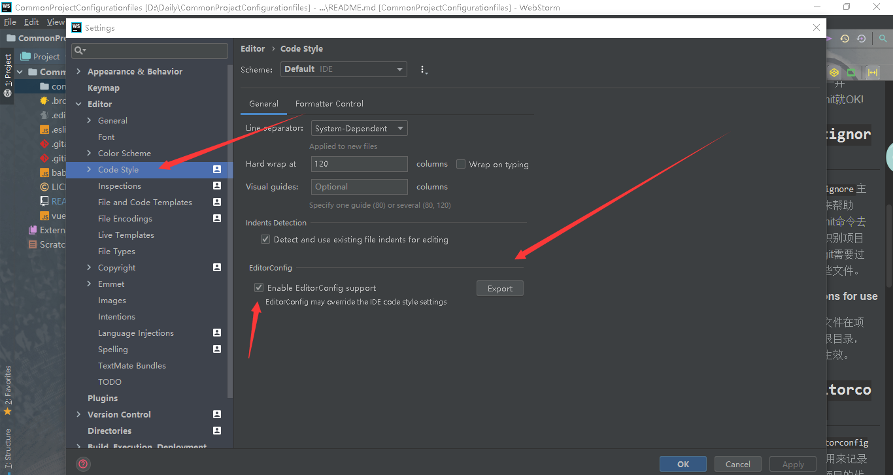
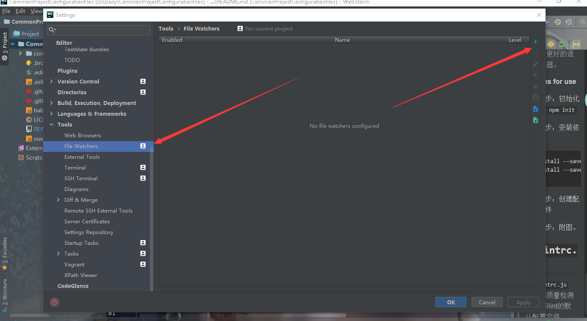
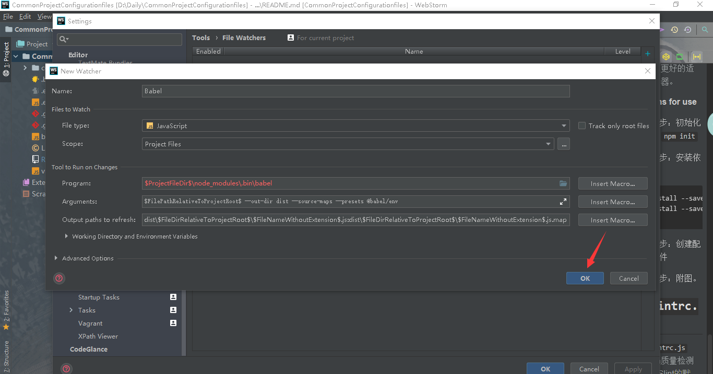
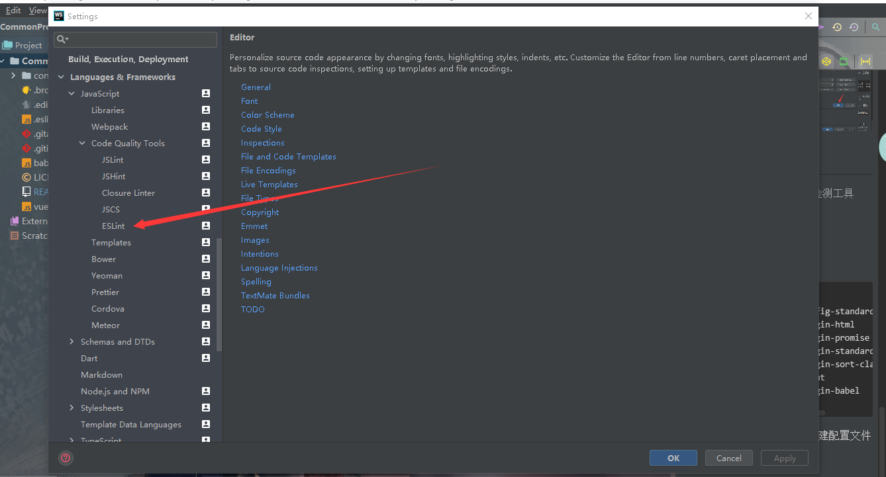
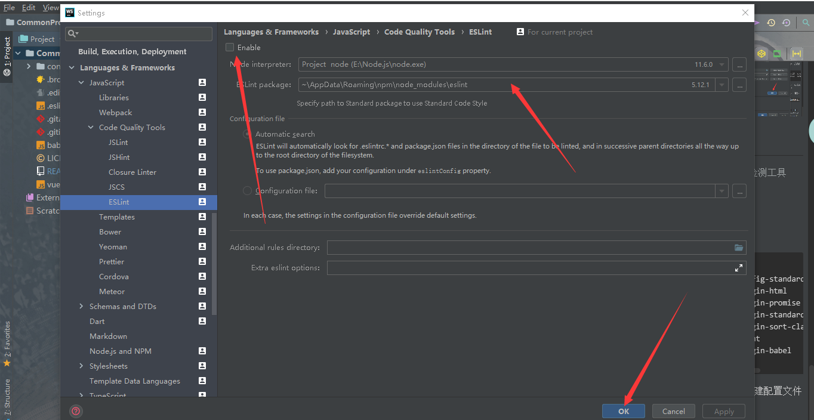
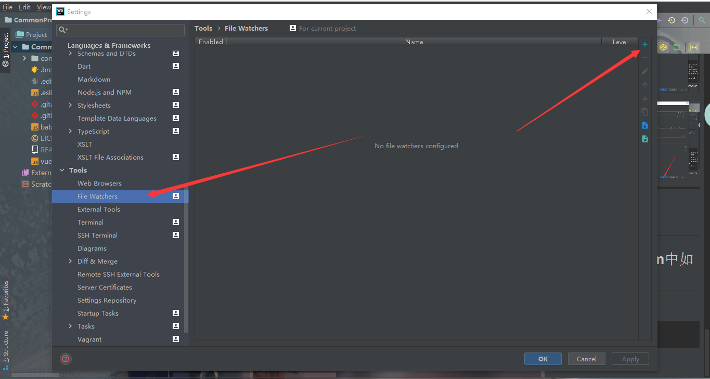
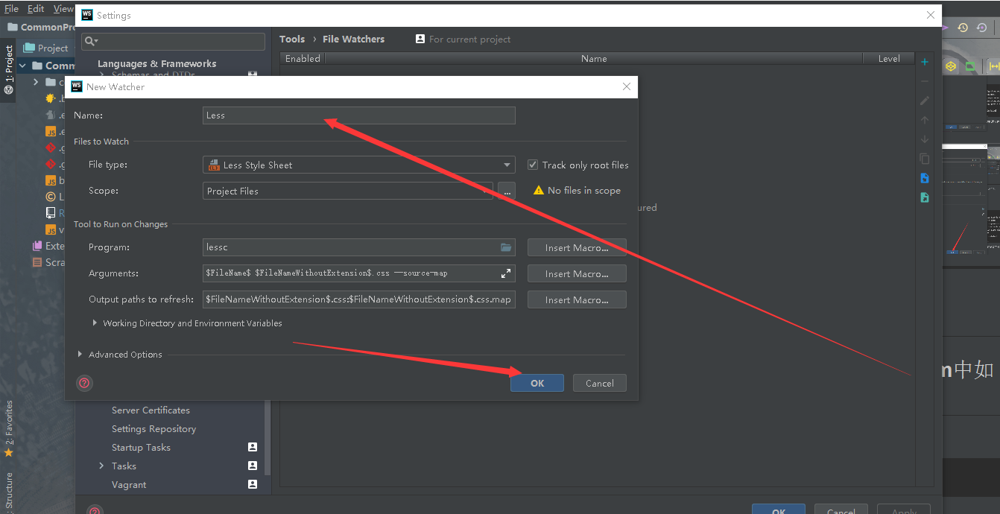

# CommonProjectConfigurationFiles

[](https://github.com/bigbigDreamer/CommonProjectConfigurationFiles)
[](https://github.com/bigbigDreamer/CommonProjectConfigurationFiles)
[](https://github.com/bigbigDreamer/CommonProjectConfigurationFiles)
[](https://github.com/bigbigDreamer/CommonProjectConfigurationFiles/blob/master/LICENSE)

# :page_with_curl:Introduce

## :page_with_curl:Self-introduction

*Hi, everybody, my name is BillWang, I am a college student from China, currently at lanzhou university of technology, grade three.*

## :page_with_curl:Project-introduction

***`CN`这个仓库主要讲解了前端项目常用的一些文件配置以及使用教学，包括一个标准前端工程师的必备软技能，如果你有兴趣，欢迎PR。***

***`EN`This repository mainly explains some common file configuration and usage teaching of front-end projects, including the necessary soft skills of a standard front-end engineer. If you are interested, welcome PR. If you have any questions, please feel free to contact me. My personal contact information is at the bottom of the document.***

# :file_folder:ConfigBox

## :bookmark:`.gitattributes`

>`.gitattributes`主要用来帮助github去更加精准的识别你的项目使用了什么语言。

##### Directions for use

- 跟随`git push`一并commit就OK!

## :bookmark:`.gitignore`

>`.gitignore`主要用来帮助commit命令去辅助识别项目上传git需要过滤哪些文件。

##### Directions for use

- 创建文件在项目的根目录，自行生效。

## :bookmark:`.editorconfig`

>`.editorconfig`主要用来记录当前项目的代码风格，保证当前项目在不同的机器以及IDE上不会出现样式错乱。

##### Directions for use

- 第一步：新建该文件夹，也可以不建立。

- 第二步：附图。



- 第三步：单击export就会自动覆盖当前项目目录下的配置文件。

## :bookmark:`.browserslistrc`

>`.browserslistrc`主要用来指定项目运行的浏览器版本或者类型。

##### Directions for use

- 参见[传送门](https://cli.vuejs.org/zh/guide/browser-compatibility.html#browserslist)

## :bookmark:`vue.config.js`

>`vue.config.js`主要用来适配Vue cli@3.0去配置vue项目，webpack会默认加载该文件。

##### Directions for use

- 第一步：`vue create newProject`

- 第二步：新建`vue.config.js`文件在项目根目录下。

- 第三步：`npm run serve`

- 配置细节参见[传送门](https://cli.vuejs.org/zh/config/#%E5%85%A8%E5%B1%80-cli-%E9%85%8D%E7%BD%AE)

## :bookmark:`babel.config.js`

>`babel.config.js`是babel@7.0的默认加载配置文件，用于将高于es5.1版本的js代码转为@5.0版本，也是为了更好的适配浏览器。

##### Directions for use

- 第一步：初始化项目 `npm init`

- 第二步：安装依赖
```bash
npm install --save-dev @babel/core @babel/cli @babel/preset-env

npm install --save @babel/polyfill
```
- 第三步：创建配置文件

- 第四步：附图。





## :bookmark:`.eslintrc.js`

>`.eslintrc.js`是代码质量检测工具ESlint的默认配置文件。

##### Directions for use

- 第一步：安装必要依赖

```bash
npm install -g eslint

npm install -g eslint-config-standard

npm install -g eslint-plugin-html

npm install -g eslint-plugin-promise

npm install -g eslint-plugin-standard

npm install -g eslint-plugin-sort-class-members

npm install -g babel-eslint

npm install -g eslint-plugin-babel
```
- 第二步：在项目根目录创建配置文件

- 第三步：附图。





-----------------------------------------------------------------------

# :muscle:IDE软技能

## :revolving_hearts:less在WebStorm中如何配置

- 第一步：安装

```bash
npm install -g less 
```
- 第二步：附图





## :revolving_hearts:Hexo搭建个人博客

- 参见[教程](https://ivu1314.club/9c29.html)
- [Hexo官网](https://hexo.io/zh-cn/docs/helpers.html#%E7%BD%91%E5%9D%80)

## :revolving_hearts:前端API编写工具之GitBook

- 参见[教程](https://yuzeshan.gitbooks.io/gitbook-studying/content/index.html)
- [GitBook官网](https://www.gitbook.com/?t=5)

## :revolving_hearts:GitHub徽章定制

- 参见[官网](https://shields.io/#/)

## :revolving_hearts:前端工程师的调色板

- 参见[官网](https://colorhunt.co/)

## :revolving_hearts:JavaScript注释标准指导

- 参见[API](http://yuri4ever.github.io/jsdoc/)

## :revolving_hearts:10个插件带你玩转Chrome

- 参见[BillWang](https://github.com/bigbigDreamer/BillWang/blob/master/blogs&&tools/10%E4%B8%AA%E6%8F%92%E4%BB%B6%E7%8E%A9%E8%BD%ACchrome.md)

## :revolving_hearts:前端程序员需要掌握的英语单词

- 参见[笔记本](Note/IT前端常用词汇.docx)[在前辈总结的基础上，持续增加中......]
- [MyNote](Note/VocabularyBook.md)[我的单词本，持续更新中......]

## :revolving_hearts:使用JSDoc自动生成代码文档

- 第一步：在代码中根据JS注释标准去书写代码注释。

- 第二步：install
```bash
npm install -g jsdoc
```

- 第三步：生成注释文档

```bash
jsdoc demo.js
```
-----------------------------------------------------------------------------

# :books:好书推荐

## :closed_book:[CSS揭秘](EBook/CSS揭秘.pdf)

## :closed_book:[精通CSS](EBook/[W3Cfuns]精通CSS：高级Web标准解决方案(第2版).pdf)


-----------------------------------------------------------------------------------------
# Statement

## :mega:Contact Me

Email:vuejs@vip.qq.com

QQ:1826001146

WeChat:17693104287

MyBlog:https://ivu1314.club

# License

[MIT](https://github.com/bigbigDreamer/CommonProjectConfigurationFiles/blob/master/LICENSE)

